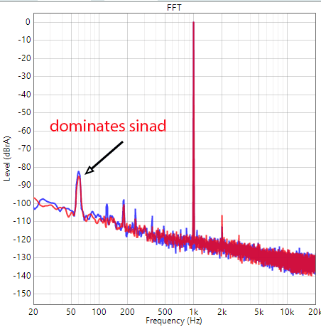
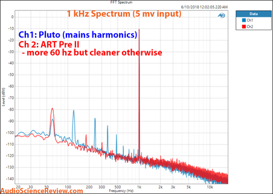
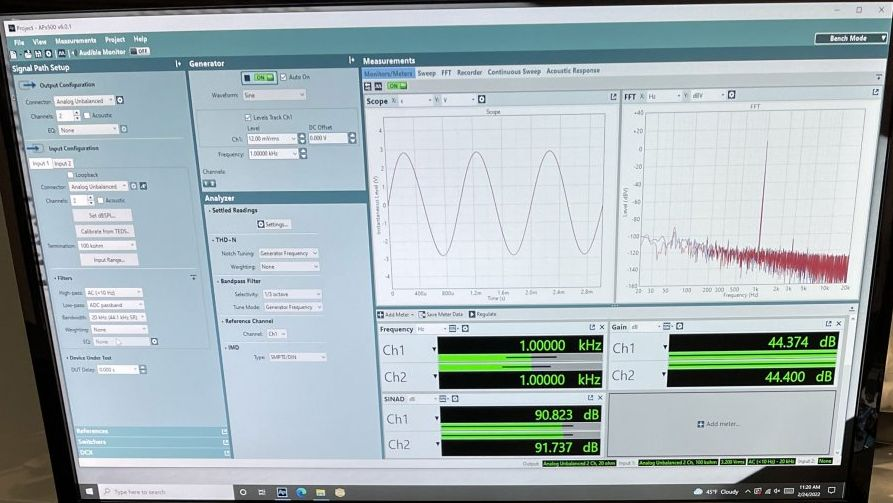

[*back*](stupid.md)  

### Audio Science [Schiit Mani 2](https://www.audiosciencereview.com/forum/index.php?threads/schiit-mani-2-review-phono-stage.31194/) vs [ART DJPRE II](https://www.audiosciencereview.com/forum/index.php?threads/review-and-measurements-of-u-turn-pluto-and-art-djpre-ii-phono-preamps.3457/) reviews

- Amir tested these at different times (2022 Feb vs 2018 Jun)
   - reporting methodology changed somewhat
|    Schiit Mani 2    |   ART DJ-PRE II   |
|---------------------|-------------------|
| | |
| SINAD 80-82         | SINAD 83.4        |

- FWIW, ART DJ-PRE II SINAD was reported beneath a graph with A-weighted measurement;   
  - whether that applies to its SINAD and also Schiit Mani 2 is unknown..
- Schiit Mani 2 1kHz peak is 0dBrA;&nbsp; ART DJ-PRE II is -10 dBV
  - even with 10dB lower 1kHz peak, ART DJ-PRE II peak at 60Hz is -78dB *on unweighted graph*,  
    while Schiit is -82dB...
- Schiit (T.M. Noble) reviewed results, suspected a bad transformer, [reported 91dB SINAD there](https://www.audiosciencereview.com/forum/index.php?threads/schiit-mani-2-review-phono-stage.31194/post-1100970):  
	
