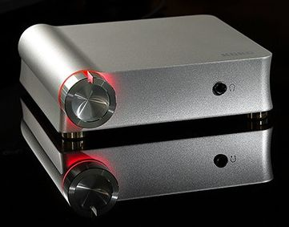

Korg DS-DAC-10R setup

### DIY DSD:  [DS-DAC-10R Windows setup](https://www.korg.com/us/products/audio/audiogate4/download.php)

  
Download KORG AudioGate and DS-DAC-10R driver.  
For the latest version of KORG AudioGate and DS-DAC-10R Setup, install:

1.  AudioGate 4
2.  DS-DAC-10R driver (only for Windows)

_Read the latest [AudioGate System requirements](https://www.korg.com/products/audio/audiogate4/page_1.php) before installing the software._  

[AudioGate and USB Audio Device Windows Setup](https://www.korg.com/us/support/download/software/0/529/2583/)
-------------------------------------------------------------------------------------------------------------

### [DS-DAC-10R Windows System Updater](https://www.korg.com/us/support/download/software/0/528/2625/)

### Activation

Either a KORG DS-DAC or MR series product is required to activate the AudioGate 4.  
Follow these steps to activate the software after installation.

#### Customers who purchased a KORG 1-bit product

1.  Connect the KORG 1-bit product to the computer where AudioGate 4 has been downloaded.
2.  Launch AudioGate 4 and the license confirmation procedure will take place automatically.  
    AudioGate 4 is now activated and ready for use.

  
_Alternatively_  

1.  Launch AudioGate 4 and the activation process will begin.
2.  Click the \[Activate\] button and the next screen will open.
3.  Connect the KORG 1-bit product to the computer.
4.  Click the \[Activate using KORG 1-bit product\] button.

The license confirmation procedure will take place automatically,  
and AudioGate 4 will be activated and ready for use.  
Once you activate AudioGate 4, you don't need to connect devices again to startup. However,  
if the computer where it is installed changes, AudioGate 4 will need activation once again.  
  
NOTE: Although usually required only once, reactivation may needed occasionally,  
depending on the computer configuration.

-   [AudioGate4 FAQ](AudioGate_4_Faq_E2_2.pdf)
-   [AudioGate4 User Guide](AudioGate4_E3a.pdf)
-   [DS-DAC-10R User Guide](DS-DAC-10R_OM_E4.pdf)
-   **DSD (64 and 128) file format support**
-   `DSDIFF` does not support metadata
-   `DSF` used by Sony Vaio PCs and e.g. [NativeDSD](https://www.nativedsd.com/free-dsd-download/)   samples at [/e/bleke/music/](Index of E__bleke_music_.html)
-   `WSD` created by '1-bit Audio Consortium'.
-   [Pink Floyd DSD128 in `.dsf`](https://archive.org/details/pink-floyd-1973-1994-DSD128)
-   [Mixing Purely in DSD](https://www.nativedsd.com/news/mixing-in-pure-dsd-no-pcm-allowed/) using [Signalyst HQPlayer Pro](https://www.signalyst.com/professional.html) instead of [Pyramix DXD](https://www.merging.com/highlights/high-resolution)
    
    * * *
    
    AudioGate help went to korguser.net for a Japanese v4.5 user guide;  
    could not register there for DS-DAC-10R...
    
    ##### challenges
    
    getting DSF out of Windows 10
    
    HDMI or DLNA
    
    [How to play DSD files on Foobar](https://www.psaudio.com/blogs/how-to/how-to-play-dsd-files-on-foobar)
    
    [Foobar2000](https://www.foobar2000.org/)
    
    [Hysolid](https://www.hysolid.com/)
    
    transforms a PC into a WAV and FLAC up to 384kHz as well as DSD from 2.8MHz to 11.2MHz in DSF player controlled by an iOS device
    
    other [Windows Hi-Res Audio players](https://www.makeuseof.com/tag/best-windows-music-players-hi-res-audio/) are paid
