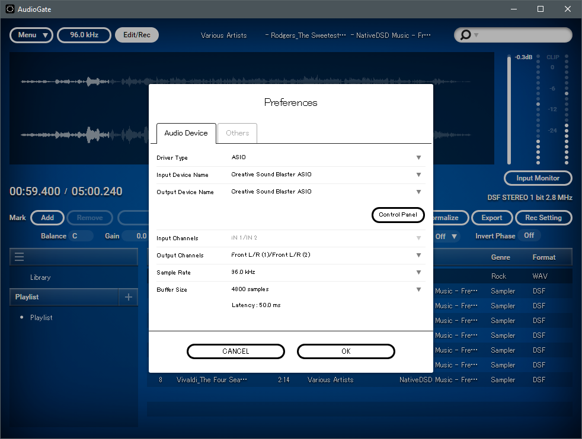
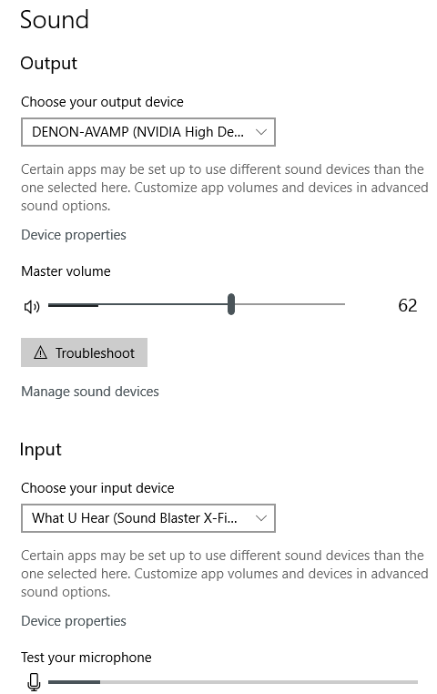

[*back*](stupid.md)  

### Windows Control Panel Sound card settings
- AudioGate4 grabs both input and output for selected device with exclusive access
   - preventing Windows default output device from playing its output
- Windows Sound Control Panel can disable exclusive access without mitigating AudioGate4 stupidity
  - as described by [Help Desk Geek](https://helpdeskgeek.com/how-to/record-sound-using-line-in-microphone-windows/)
  - launch Control Panel (NOT settings)  
      
    - search for `Sound`, select `Change sound card settings`:      
		  
    - Select device and `Recording`  
		  
	- **Check `Listen to this device`, if offered**  
		  
	- Under `Advanced`, disallow `Exclusive Mode`  
		
### AudioGate4 stupidity DSD playback work-around using Creative Sound Blaster X-Fi Surround 5.1 Pro
- Sound setting (NOT control panel)
	- with AudioGate4 `Menu > Edit > Preferences` set to `Creative Sound Blaster ASIO`:  
		
	- set Input device to `What U Hear Sound Blaster X-Fi`:  
		  
	- This probably works (provided that `Listen` is enabled in Control Panel)  
	 because X-Fi provides *multiple sound devices* to Windows.
