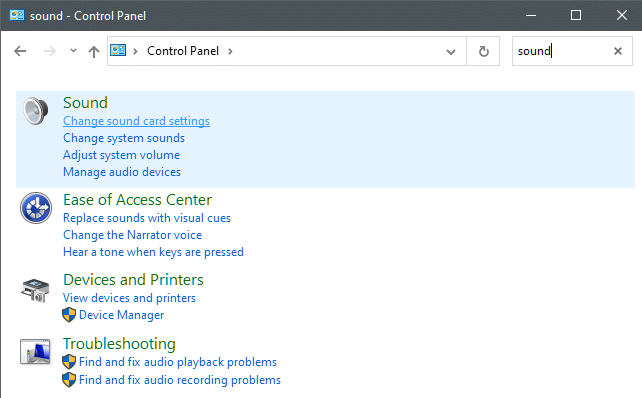
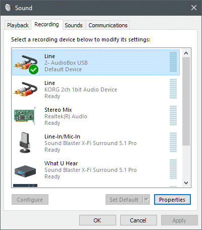
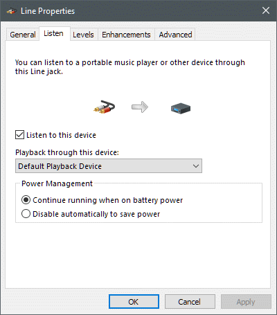
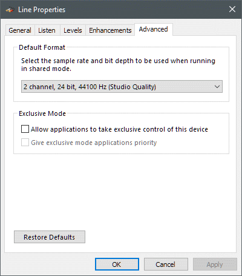

[*back*](stupid.md)  

### Windows Control Panel settings
- AudioGate4 grabs both input and output for selected device with exclusive access
   - preventing Windows default output device from playing its output
- Windows Sound Control Panel can disable exclusive access without mitigating AudioGate4 stupidity
  - as described by [Help Desk Geek](https://helpdeskgeek.com/how-to/record-sound-using-line-in-microphone-windows/)
  - launch Control Panel (NOT settings)  
      
    - search for `Sound`, select `Change sound card settings`:      
		  
    - Select device and `Recording`  
		  
	- Check `Listen to this device`, if offered  
		  
	- Under `Advanced`, disallow `Exclusive Mode`  
		
